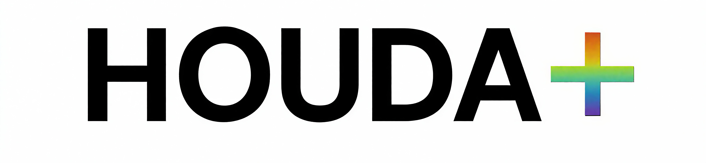

## 🌐 HOUDA+ 官网

[](https://houda.pages.dev/)
[](https://github.com/houda-hd/houda-hd.github.io/stargazers)
[](https://github.com/houda-hd/houda-hd.github.io/commits/main)

---

## 🏛️ 项目简介
**HOUDA+ 官网** 是长沙霉粉联盟六群分支的粉丝站点，全称为「侯明昊碗慧通讯录互吃大学」。

项目基于 **GitHub Pages** 构建，用于展示侯大文化与社区活动，同时作为视觉统一与轻量架构的实验平台。

**访问地址：** https://houda.pages.dev/

---

## 🧩 功能特色
- **统一设计体系**：主站页面共用 HOUDA+ 设计令牌（浅色主题、Plus Jakarta Sans 字体、Phosphor 图标、统一动效曲线），风格协调一致。
- **响应式布局**：自适应桌面端与移动端，输入框等组件在窄屏下等宽、易点按。
- **网站地图**：`sitemap.html` 串联全站导航，工具页以相对路径 `tools/xxx.html` 链接。
- **趣味小工具**：身份证生成器（含正反面 3D 翻转）、情侣盘点、纪念日、HDTI 人格测试、IP 纯净度检测、美国免税州地址生成器等。
- **无障碍版本**：`hv/Accessibility.html` 提供长辈版适配。

---

## ⚙️ 技术栈
| 技术 | 说明 |
|:--|:--|
| **HTML5 / CSS3** | 页面结构与样式，主站为自研 HOUDA+ 设计体系（非框架） |
| **JavaScript (Vanilla)** | 前端交互逻辑，无构建步骤 |
| **Phosphor Icons** | 主站图标系统（替代 Font Awesome） |
| **Plus Jakarta Sans** | 主站字体（Google Fonts） |
| **GitHub Pages** | 托管与自动部署 |
| Tailwind CSS（仅 hv/） | 仅历史版本 `hv/index.html` 使用，主站不涉及 |

---

## 📂 项目结构
```
houda-hd.github.io/
├── index.html              # 主站首页（HOUDA+ 设计体系基准）
├── sitemap.html            # 网站地图 / 导航中枢
├── lover-name.html         # 情侣盘点
├── houda-id-generator.html # 侯大身份证生成器（含正反面翻转）
├── 404.html                # 404 错误页
├── tools/                  # 功能型小工具
│   ├── anniversary.html    # 侯大纪念日
│   ├── hdti-test.html       # HDTI 测试（侯大人格实验室）
│   ├── ippure.html          # IP 检测与纯净度分析
│   └── mianshui.html        # 美国免税州地址生成器
├── hv/                     # history version 历史版本（归档 / 换皮 / 旧版）
│   ├── 26S2.html            # 原正式版首页（归档）
│   ├── index.html           # Tailwind 版首页
│   ├── Apple.html           # 仿 Apple 风格
│   ├── Spotify.html         # 仿 Spotify 风格
│   ├── Accessibility.html    # 长辈版（无障碍）
│   └── english-daily-quote.html # 英文每日一言
├── assets/                 # 图片等资源
├── README.md
├── CHANGELOG.md
├── CONTRIBUTING.md
├── CODE_OF_CONDUCT.md
├── SECURITY.md
├── LICENSE
└── robots.txt
```

---

## 📁 目录说明

### 根目录（主站线上页面）
| 文件 | 说明 |
|:--|:--|
| `index.html` | 主站首页，HOUDA+ 设计体系基准 |
| `sitemap.html` | 网站地图 / 导航中枢 |
| `lover-name.html` | 情侣盘点 |
| `houda-id-generator.html` | 侯大身份证生成器 |
| `404.html` | 404 错误页 |

### tools/（功能型小工具）
| 文件 | 说明 |
|:--|:--|
| `anniversary.html` | 侯大纪念日 |
| `hdti-test.html` | HDTI 测试（侯大人格实验室） |
| `ippure.html` | IP 检测与纯净度分析 |
| `mianshui.html` | 美国免税州地址生成器 |

### hv/（history version 历史版本）
存放归档、换皮与旧版页面，未接入 `sitemap.html`，默认不对外开放（直接输入 URL 仍可访问）：
| 文件 | 说明 |
|:--|:--|
| `26S2.html` | 原正式版首页（归档） |
| `index.html` | Tailwind 版首页 |
| `Apple.html` | 仿 Apple 风格 |
| `Spotify.html` | 仿 Spotify 风格 |
| `Accessibility.html` | 长辈版（无障碍） |
| `english-daily-quote.html` | 英文每日一言 |

---

## 🛠️ 本地预览
无需构建，直接用浏览器打开 `index.html` 即可。若需本地服务器（推荐，可避免个别浏览器对本地文件的限制）：

```bash
# 在项目根目录执行
python3 -m http.server 8000
# 然后访问 http://localhost:8000
```

---

## 📜 更新日志
完整更新记录见 [CHANGELOG.md](./CHANGELOG.md)。

---

## 🤝 参与与协作

### 提交问题或建议
欢迎在 [Issues 页面](https://github.com/houda-hd/houda-hd.github.io/issues) 反馈 Bug、建议或改进想法。

### 成为项目维护者
如需成为仓库管理者或长期参与协作，请私信项目维护者。

协作规范详见 [CONTRIBUTING.md](./CONTRIBUTING.md)。

---

## 🧾 许可证
本项目遵循 [MIT License](LICENSE)。可自由使用、修改与分发，但需保留原作者信息。
